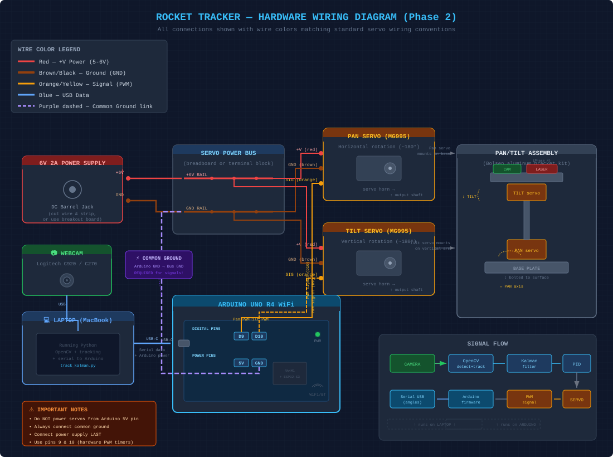

# 🚀 Rocket Tracker

A computer vision system that visually tracks model rockets in flight and points a laser at them. Built as a learning project covering OpenCV, Kalman filters, PID control, servo/brushless motor control, and real-time embedded systems.

## Project Phases

| Phase | Status | Description |
|-------|--------|-------------|
| 1. Software Tracking | ✅ Complete | Color detection + Kalman filter in OpenCV |
| 2. Pan/Tilt Gimbal | ✅ Complete | MG995 servos, Arduino UNO R4 WiFi, serial control |
| 3. Closed-Loop Control | ✅ Complete | Camera-on-gimbal PID tracking with live tuning |
| 4. Hardware Upgrade | 🔜 Next | Brushless gimbal motors (2804 + SimpleFOC), laser pointer |
| 5. Outdoor Rocket Tracking | 📋 Planned | Field testing with model rockets |

## System Architecture

```
Camera → OpenCV Detection → Kalman Filter → PID Controller → Serial → Arduino → Servos
  ↑                                                                              |
  └──────────────────── closed-loop feedback ──────────────────────────────────────┘
```

## Hardware Wiring



### Current Hardware (Phase 2-3)
- Arduino UNO R4 WiFi
- 2x MG995 metal gear servos
- Bolsen aluminum pan/tilt bracket
- Logitech C920 webcam
- 6V 2A power supply

### Planned Hardware (Phase 4)
- MKS Dual FOC V3.2 + ESP32 controller
- 2x 2804 brushless gimbal motors with AS5600 encoders
- 5mW 650nm red laser module
- 12V 3A power supply

## Repository Structure

```
rocket-tracker/
├── vision/                     # Detection & tracking code
│   ├── track_color.py          # Phase 1a: HSV color detection with calibration
│   └── track_kalman.py         # Phase 1b: Kalman filter tracking
├── control/                    # Gimbal control code
│   ├── track_gimbal.py         # Phase 3: Closed-loop PID tracking (main script)
│   └── servo_serial.py         # Phase 2: Serial interface to Arduino
├── firmware/                   # Arduino code
│   └── servo_controller/
│       └── servo_controller.ino  # Servo control firmware (UNO R4 WiFi)
├── hardware/                   # Wiring diagrams, CAD files
│   └── wiring_diagram.svg
├── docs/                       # Documentation & learning resources
│   ├── notebook.md             # Engineering notebook / build log
│   ├── assembly_guide.md       # Step-by-step gimbal assembly instructions
│   ├── phase4_hardware.md      # Phase 4 shopping list & rationale
│   ├── camera_sensor_diagram.html  # Interactive: how camera sensors work
│   └── kalman_deep_dive.html   # Interactive: Kalman filter visualization
├── experiments/                # Test scripts
├── requirements.txt
└── README.md
```

## Quick Start

### Setup
```bash
git clone https://github.com/YOUR_USERNAME/rocket-tracker.git
cd rocket-tracker
python -m venv venv
source venv/bin/activate
pip install -r requirements.txt
```

### Phase 1: Software-Only Tracking (no hardware needed)
```bash
# Basic color detection — press 'c' to calibrate HSV
python vision/track_color.py

# With Kalman filter prediction
python vision/track_kalman.py
```

### Phase 2: Servo Testing
1. Upload `firmware/servo_controller/servo_controller.ino` via Arduino IDE
2. Board: Arduino UNO R4 WiFi, Baud: 115200
```bash
# Interactive servo commands
python control/servo_serial.py

# Automated demo sequence
python control/servo_serial.py --demo
```

### Phase 3: Closed-Loop Tracking
```bash
# Full tracking with gimbal (auto-detects Arduino)
python control/track_gimbal.py --camera 1

# Vision-only mode (no Arduino needed)
python control/track_gimbal.py --camera 0 --no-serial
```

#### Tracking Controls (press in camera window)
| Key | Action |
|-----|--------|
| `q` | Quit |
| `h` | Home servos to center |
| `p` | Pause/resume tracking |
| `c` | Toggle HSV calibration |
| `s` | Print current HSV values |
| `1` / `2` / `3` | PID preset: conservative / balanced / aggressive |
| `+` / `-` | Fine-tune P gain |
| `x` / `y` | Flip pan / tilt direction |

#### HSV Calibration
Default values tuned for a red marker cap against mixed backgrounds:
- Lower: `[0, 180, 50]`
- Upper: `[10, 255, 255]`

Press `c` to open calibration sliders and adjust for your object/environment.

## Key Concepts Learned

### Computer Vision
- **HSV color space** — separating color (hue) from brightness for robust detection
- **Morphological operations** — erode/dilate to clean up binary masks
- **Contour detection** — finding object boundaries in filtered images

### State Estimation
- **Kalman filter** — predicting object position during detection dropouts using a constant-velocity model
- **Measurement vs. prediction** — using raw measurements for PID, Kalman only for coasting

### Control Theory
- **PID control** — proportional correction of pixel error to servo angle adjustment
- **Closed-loop feedback** — camera mounted on gimbal creates a true feedback loop
- **Tuning** — P-only control with dead zone works best for this system; I causes integral windup, D amplifies detection noise
- **Output clamping** — limiting max degrees/frame prevents saturation and oscillation

### Embedded Systems
- **Serial communication** — laptop ↔ Arduino over USB at 115200 baud
- **PWM servo control** — pulse width encoding for hobby servos
- **Common ground** — shared voltage reference between separate power supplies
- **Arduino UNO R4 WiFi** — USB CDC serial requires timeout on `while(!Serial)`

## Current PID Settings (Phase 3)

```
Conservative:  P=0.015  I=0  D=0  (output limit: 1.5°/frame)
Balanced:      P=0.03   I=0  D=0
Aggressive:    P=0.06   I=0  D=0
Dead zone:     ±15 pixels (ignores sub-pixel detection noise)
```

## License

This is a personal learning project. Feel free to use it for your own learning.
